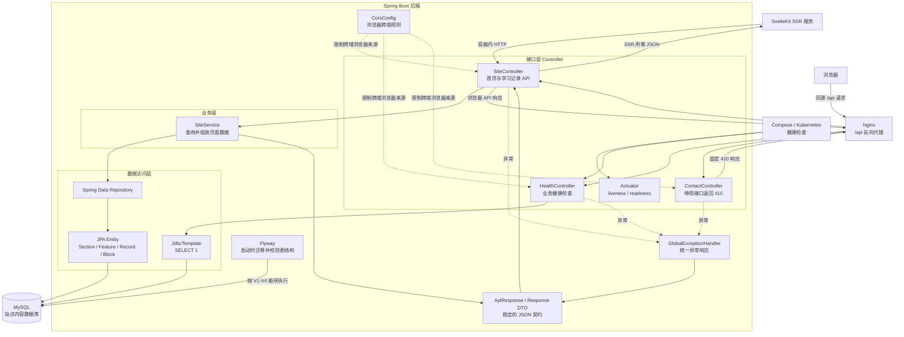

# 后端架构图

## 整体结构

## 分层职责

| 层级 | 主要文件 | 作用 |
| --- | --- | --- |
| 接口层 | `SiteController.java`、`HealthController.java`、`ContactController.java` | 定义 URL、HTTP 状态和对外响应 |
| 业务层 | `SiteService.java` | 从多张表读取内容，映射成首页和文章响应 |
| 数据访问层 | `*Repository.java` | 由 Spring Data 根据方法名生成数据库查询 |
| 实体层 | `SiteSection.java`、`SiteFeature.java`、`SiteLearningRecord*.java` | 描述 Java 对象与 MySQL 表字段的对应关系 |
| 响应契约 | `ApiResponse.java`、`HomePageResponse.java`、`LearningRecordResponse.java` | 隔离数据库实体与前端 JSON，保持接口字段稳定 |
| 横切配置 | `CorsConfig.java`、`GlobalExceptionHandler.java` | 统一处理跨域访问和异常格式 |
| 数据迁移 | `backend/src/main/resources/db/migration/V*.sql` | 按版本创建表、初始化内容和更新学习记录 |
| 运行检查 | `HealthController.java`、Actuator 配置 | 同时确认 Java 进程、Spring 状态和数据库连接 |

## 一次首页 API 请求如何完成

1. SvelteKit 根据 `API_BASE_URL` 在容器网络内直接请求 `http://backend:18080/api/site/home`，不绕行公网 Nginx。
2. 浏览器直接访问同源 `/api` 时由 Nginx 转发；`CorsConfig` 只约束真正的跨域浏览器来源。
3. `SiteController.home()` 调用 `SiteService.getHomePage()`。
4. `SiteService` 分别查询 Hero、能力卡片和学习记录，并把 JPA 实体转换成响应 DTO。
5. `ApiResponse.success()` 在 DTO 外层增加统一的 `code`、`message` 和 `data`。
6. Spring Boot 将对象序列化成 JSON，直接返回 SvelteKit SSR 服务。

## 启动与数据库关系

1. Spring Boot 启动时，Flyway 先检查已执行迁移的 checksum。
2. 未执行的新版本 SQL 按版本号顺序运行。
3. Hibernate 使用 `ddl-auto: validate`，只验证 JPA 实体与表结构，不自动修改数据库。
4. 数据库和应用准备完成后，Actuator readiness 才用于接收部署流量。

## 推荐阅读顺序

`AbilityReApplication.java` -> `SiteController.java` -> `SiteService.java` -> `*Repository.java` -> JPA 实体 -> `LearningRecordResponse.java` -> Flyway SQL
