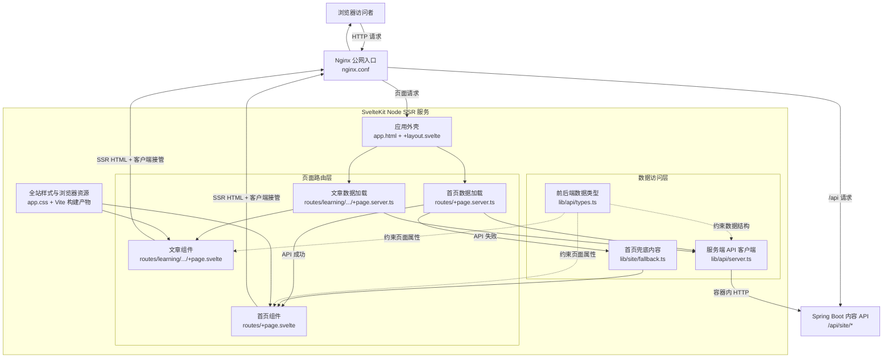

# 前端架构图

## 整体结构

## 模块职责

| 层级 | 主要文件 | 作用 |
| --- | --- | --- |
| 公网入口 | `nginx.conf` | 接收浏览器请求，把页面交给 SvelteKit，把 `/api` 请求交给 Spring Boot |
| 应用外壳 | `frontend/src/app.html`、`frontend/src/routes/+layout.svelte` | 注入页面 head、SSR 正文和全站样式 |
| 服务端加载 | `frontend/src/routes/**/+page.server.ts` | 在 Node 服务端读取后端数据，决定成功、兜底或失败状态 |
| 页面组件 | `frontend/src/routes/**/+page.svelte` | 把路由数据渲染成首页或文章 HTML |
| API 封装 | `frontend/src/lib/api/server.ts` | 统一设置后端地址、检查 HTTP 状态并解包响应 |
| 类型契约 | `frontend/src/lib/api/types.ts` | 保证 TypeScript 字段与 Spring Boot 响应一致 |
| 内容兜底 | `frontend/src/lib/site/fallback.ts` | 后端短暂不可用时仍能渲染首页 |
| 构建运行 | `frontend/vite.config.ts`、`frontend/svelte.config.js` | 使用 Vite 构建，并通过 adapter-node 生成 Node SSR 服务 |

## 一次首页请求如何完成

1. 浏览器请求首页，Nginx 将请求转发给 `frontend-app:3000`。
2. SvelteKit 匹配 `/` 路由并执行 `routes/+page.server.ts`。
3. server load 通过 `lib/api/server.ts` 请求 Spring Boot 的 `/api/site/home`。
4. 请求成功时，数据库内容传给 `routes/+page.svelte`；失败时改用 `fallbackHomePage`。
5. SvelteKit 在服务端生成完整 HTML，经 Nginx 返回浏览器。
6. 浏览器加载 Vite 生成的客户端资源并接管页面，后续导航可以复用 SvelteKit 路由能力。

## 推荐阅读顺序

`app.html` -> `+layout.svelte` -> `routes/+page.server.ts` -> `lib/api/server.ts` -> `routes/+page.svelte` -> `app.css`
